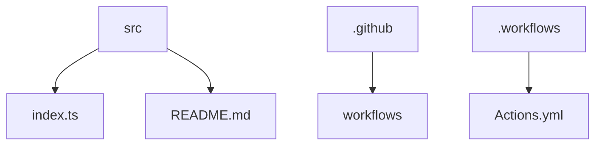

# Crypto Actions 🚀


## 🗂️ Description

Crypto Actions is a GitHub repository that utilizes GitHub Actions to fetch and display real-time cryptocurrency prices on the README file. This project is designed for developers and cryptocurrency enthusiasts who want to stay up-to-date with the latest market prices. The repository uses the CoinGecko API to fetch cryptocurrency data and updates the README file twice a day.

The project showcases a simple yet effective way to leverage GitHub Actions for automating tasks and updating README files with dynamic content.

## ✨ Key Features

### 💻 Core Functionality

* Fetches cryptocurrency prices from the CoinGecko API
* Updates the README file with real-time market data
* Uses GitHub Actions for automation

### 📊 Data Management

* Handles errors and exceptions when fetching data
* Uses environment variables for API keys

## 🗂️ Folder Structure



## 🛠️ Tech Stack


## ⚙️ Setup Instructions

To run this project locally:

* Git clone the repository: https://github.com/abhraneeldhar7/crypto-actions.git
* Install dependencies using Bun: `bun install`
* Run the development script: `bun run dev`

## 📈 GitHub Actions

The repository uses a GitHub Actions workflow named 'Daily Readme Update' to fetch cryptocurrency prices and update the README file. The workflow runs twice a day and uses secrets for API keys.

```yml
name: Daily Readme Update

on:
  schedule:
    - cron: 0 8,20 * * *

jobs:
  update-readme:
    runs-on: ubuntu-latest
    steps:
      - name: Checkout repository
        uses: actions/checkout@v2

      - name: Setup Bun
        uses: oven-sh/setup-bun@v1

      - name: Run dev script
        run: bun run dev

      - name: Update README
        run: bun run update-readme
        env:
          API_KEY: ${{ secrets.API_KEY }}
```

## 📝 Configuration Files

The repository uses the following configuration files:

* `tsconfig.json`: Configures the TypeScript compiler
* `package.json`: Defines the project structure and dependencies
* `.gitignore`: Specifies files and directories to ignore in the Git repository

## 🤖 Main Entry Point

The main entry point of the project is `index.ts`, which imports the `writeFileSync` function from the `fs` module and defines interfaces for currency and cryptocurrency data. The `getValues` function fetches cryptocurrency prices from the CoinGecko API, formats the data, and writes it to the README.md file.


<br><br>
<div align="center">

<h3>Abhra the Neel</h3>
<p>Full-stack developer with expertise in web, Android, and server-side development. Most projects are private due to being production code.</p>
</div>
<br>
<p align="right">
  <a href="https://gitfull.vercel.app">Made by GitFull</a>
</p>
    