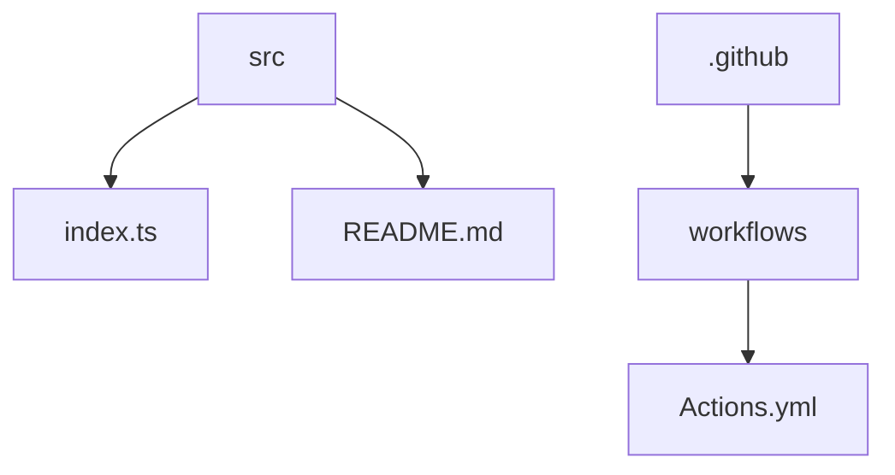

# Crypto Actions 🚀


## 🗂️ Description

Crypto Actions is a GitHub repository that fetches and updates cryptocurrency prices in the README file. This project is designed for developers and cryptocurrency enthusiasts who want to stay up-to-date with the latest market prices. The repository uses a daily GitHub Actions workflow to fetch prices from the CoinGecko API and update the README file.

The project provides a simple and efficient way to display cryptocurrency prices, making it a great starting point for developers looking to build similar projects or integrate cryptocurrency data into their applications.

## ✨ Key Features

### **Cryptocurrency Price Updates** 📊

* Fetches cryptocurrency prices from the CoinGecko API
* Updates the README file with the latest prices
* Daily updates via GitHub Actions workflow

### **Tech Stack** 💻

* Built with TypeScript and Bun
* Uses the CoinGecko API for cryptocurrency data

## 🗂️ Folder Structure



## 🛠️ Tech Stack


## ⚙️ Setup Instructions

To run the project locally, follow these steps:

* Git clone the repository: `https://github.com/Xeven777/crypto-actions.git`
* Install dependencies: `bun install`
* Run the project: `bun run index.ts`

## 📈 GitHub Actions

The repository uses a daily GitHub Actions workflow to update the README file with cryptocurrency prices. The workflow is defined in the `.github/workflows/Actions.yml` file.

```yml
name: Update README

on:
  schedule:
    - cron: 0 0 * * *

jobs:
  update-readme:
    runs-on: ubuntu-latest
    steps:
      - name: Checkout code
        uses: actions/checkout@v2

      - name: Setup Bun
        run: |
          curl https://bun.sh/install | sh

      - name: Run script
        run: |
          bun run index.ts

      - name: Commit changes
        run: |
          git config --local user.email "github-actions[bot]@users.noreply.github.com"
          git config --local user.name "github-actions[bot]"
          git add .
          git commit -m "Update README" || exit 0
          git push origin main
```

## 📝 Configuration Files

The project uses the following configuration files:

* `tsconfig.json`: Configures the TypeScript compiler
* `package.json`: Defines project metadata, dependencies, and scripts
* `.gitignore`: Specifies files and directories to ignore in the Git repository
* `bun.lockb`: Specifies dependencies and their versions used in the project


<br><br>
<div align="center">

<h3>Anish</h3>
<p>Passionate developer with a love for problem-solving, efficient and creative thinking.</p>
</div>
<br>
<p align="right">
  <a href="https://gitfull.vercel.app">Made by GitFull</a>
</p>
    
