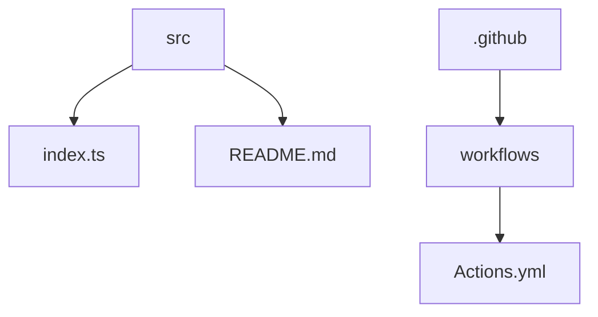

# Crypto Actions 🚀

## 🗂️ Description

Crypto Actions is a GitHub repository that utilizes GitHub Actions to fetch and display real-time cryptocurrency prices. The project is designed for developers and cryptocurrency enthusiasts who want to stay up-to-date with the latest market prices. The repository uses the CoinGecko API to fetch cryptocurrency data and updates the README file with the latest prices.

The project showcases a unique use case for GitHub Actions, where a workflow is triggered twice a day to update the README file with the latest cryptocurrency prices. This approach demonstrates a creative way to leverage GitHub Actions for automating tasks and providing real-time information.

## ✨ Key Features

### Core Features

* **Real-time Cryptocurrency Prices**: Fetch and display real-time cryptocurrency prices using the CoinGecko API.
* **GitHub Actions Workflow**: Utilize a GitHub Actions workflow to automate the process of updating the README file with the latest prices.
* **TypeScript Support**: Leverage TypeScript for type-safe and maintainable code.

### Technical Features

* **Bun Package Manager**: Use Bun as the package manager for efficient dependency management.
* **TypeScript Configuration**: Configure TypeScript for optimal compilation and module resolution.

## 🗂️ Folder Structure

## 🛠️ Tech Stack

## ⚙️ Setup Instructions

To run the project locally, follow these steps:

* Clone the repository: `git clone https://github.com/abhraneeldhar7/crypto-actions.git`
* Install dependencies: `bun install`
* Run the development script: `bun run dev`

Note: Make sure to set up your API keys as environment variables to use the CoinGecko API.

## 📈 GitHub Actions

The `.github/workflows/Actions.yml` file defines a GitHub Actions workflow named Daily Readme Update. The workflow is triggered on a schedule (twice a day) and performs the following steps:

1. Checks out the repository
2. Sets up Bun
3. Runs the `dev` script (which updates the README.md file)
4. Pushes the changes back to the repository

The workflow uses secrets for API keys and configures Git to commit changes.

## 📝 Configuration Files

The project uses the following configuration files:

* `tsconfig.json`: Configures the TypeScript compiler for optimal compilation and module resolution.
* `package.json`: Specifies metadata for the project, including its name, module entry point, scripts, and dependencies.
* `.gitignore`: Specifies files and directories that should be ignored by Git.

  

<h3>Abhra the Neel</h3>

Full-stack developer with expertise in web, Android, and server-side development. Most projects are private due to being production code.

 

  <a href="https://gitfull.vercel.app">Made by GitFull</a>

    